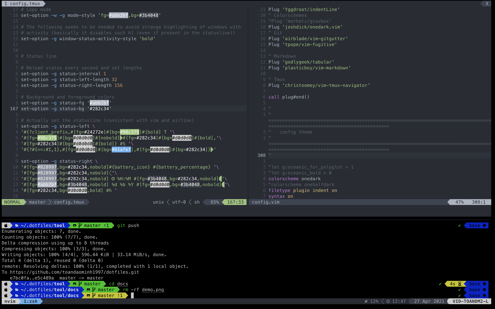

# dotfiles
A set of vim/nvim, zsh/oh-my-zsh, and tmux configuration files.

## Basic Installation

Dotfiles is installed by running one of the following commands in your terminal. You can install this via the command-line with `git`.

#### Install dotfiles
```bash
git clone https://github.com/toandaominh1997/dotfiles.git $HOME/.dotfiles/tool
bash $HOME/.dotfiles/tool/install.sh --user
```
#### Upgrade dotfiles
```bash
bash $HOME/.dotfiles/tool/install.sh --user -U
```

## How to use

### Vim/nvim
vim cheatsheet: [https://vim.rtorr.com/](https://vim.rtorr.com/)
#### Map
```
:nmap
:vmap
:imap
```

#### Packer 
```
// update package
:PackerUpdate 
:PackerInstall
```
#### Lsp
```
:LspLog
// change python path
let g:python3_host_prog = 'path/python'
```

#### Nvim Tree 
```
// NvimTreeFocus
<leader>tt

// NVimTreeFindFile
<leader>nf
```

#### Tree Sitter

```
TSInstall {lang}
TSUpdate
```
#### Telescope
```
// find files:
<leader>ff

// live grep
<learder>fg

// buffers
<leader>fb

// Helper 
<leader>fh
```

#### Comment
```
visual-text > gc
```

### Tmux 
tmux cheatsheet: [https://tmuxcheatsheet.com/](https://tmuxcheatsheet.com/)

- create window
```
control + a + c
```


### Updating oh-my-zsh
```
omz update
```
## Visualization

 
