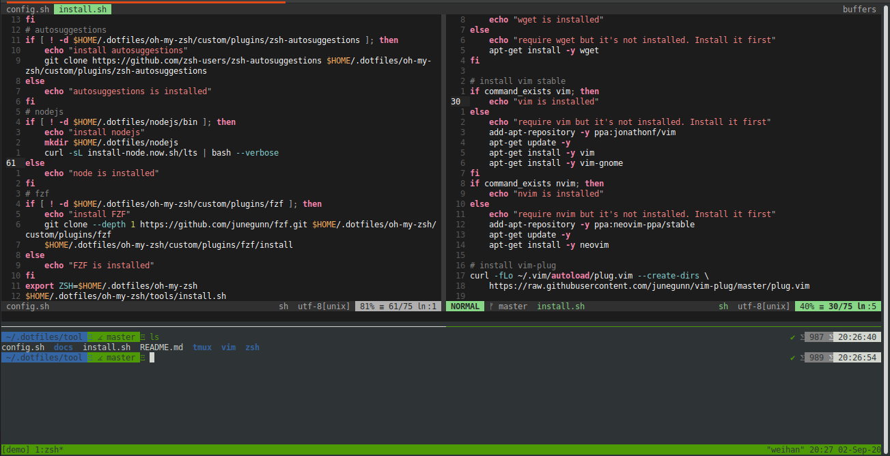

# dotfiles
A set of vim/nvim, zsh, and tmux configuration files.

### Basic Installation

Dotfiles is installed by running one of the following commands in your terminal. You can install this via the command-line with `git`.
```bash
git clone https://github.com/toandaominh1997/dotfiles.git $HOME/.dotfiles/tool
sudo bash $HOME/.dotfiles/tool/install.sh

For detail:
    if you in 'sudo':
        bash $HOME/.dotfiles/tool/install.sh
    else:
        you need to install git, zsh, tmux, cmake first.
        then
        bash $HOME/.dotfiles/tool/install.sh
Notes:
    For install nodejs, nvim via snap:
        sudo bash snap.sh
```
### Visualization



 