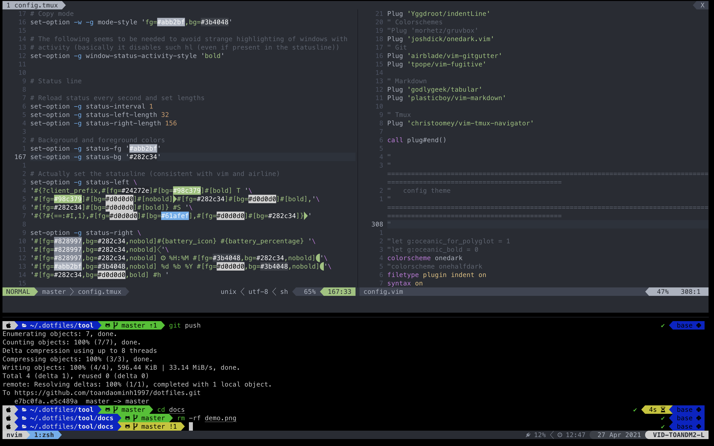

# dotfiles

A Rust-powered dotfiles bootstrapper for a personal developer environment with first-class support for macOS and Ubuntu.



---

## What's inside

| Layer | Tool | Details |
|---|---|---|
| **Bootstrapper** | `dotup` | Rust CLI for install, dry-run, doctor, and sync workflows |
| **Shell** | Zsh + Oh-My-Zsh + Starship | Shared shell config with optional local overrides |
| **Editor** | Neovim (LazyVim) | Bootstrapped when no existing Neovim config is present |
| **Multiplexer** | Tmux + TPM | Shared defaults with clipboard integrations and local overrides |
| **Terminal** | WezTerm | Personal defaults with documented font expectations |
| **Package management** | Homebrew on macOS, APT on Ubuntu | Other Linux package managers remain best-effort |
| **IDE integration** | IdeaVim | JetBrains Vim motions via `vim/ideavimrc.vim` |

---

## Quick start

```bash
git clone https://github.com/toandaominh1997/dotfiles.git "$HOME/.dotfiles/tool"
cd "$HOME/.dotfiles/tool"
cargo run -- --auto
```

Restart your terminal, then:

1. Open tmux and press `prefix + I` to install tmux plugins
2. Open `nvim` and let LazyVim finish plugin sync if this is a fresh install

---

## Support model

- **First-class platforms:** macOS and Ubuntu
- **Best-effort platforms:** other Linux distributions supported through existing package-manager adapters
- **GUI app installation:** macOS-only
- **Setup bias:** personal machine defaults first, with explicit local overrides for machine-specific differences

---

## Dotup CLI

```bash
cargo run -- --auto
cargo run -- --auto --upgrade --verbose
cargo run -- --dry-run
cargo run -- --doctor
cargo run -- --auto --profile work
```

### Profiles

Profiles are defined in `dotup.toml`:

- `default` — personal baseline with shell, editor, tmux, and core CLI tools
- `work` — adds common work tooling such as AWS CLI, Docker, Kubernetes, Node, Rust, and Terraform
- `minimal` — smaller shell and terminal setup

### Install flow

`dotup` orchestrates setup in this order:

1. Initialize the platform package manager
2. Install required packages from the selected profile
3. Install optional packages from the selected profile
4. Install macOS casks when running on macOS
5. Install fonts
6. Configure zsh
7. Configure tmux and TPM
8. Configure Vim and Neovim

Existing configs are backed up with a timestamp before being overwritten.

---

## Zsh

The generated `~/.zshrc` sources `~/.dotfiles/tool/zsh/config.zsh`.

Highlights:

- Starship prompt
- Oh-My-Zsh with plugin-based completion and UX improvements
- macOS Homebrew shellenv bootstrapping
- optional machine-local additions via `~/.zshrc.local`

Update Oh-My-Zsh:

```bash
omz update
```

---

## Tmux

**Prefix:** `Ctrl+a`

Highlights:

- TPM-managed plugins
- vim-tmux pane navigation
- clipboard integration through `pbcopy`, `xsel`, `xclip`, or `wl-copy`
- optional machine-local additions via `~/.tmux.conf.local`

Install tmux plugins after first setup:

```bash
tmux
# then press prefix + I
```

---

## Neovim

Neovim is bootstrapped from the [LazyVim](https://www.lazyvim.org/) starter when `~/.config/nvim` is absent or empty. If an existing non-LazyVim config is present, `dotup` skips installation instead of overwriting it.

Use these commands inside Neovim when needed:

```vim
:Lazy sync
:Lazy update
:Mason
:TSUpdate
```

---

## WezTerm

Config lives at `wezterm/wezterm.lua`.

- Preferred font: `AestheticIosevka Nerd Font Mono`
- color scheme: Aesthetic Night
- pane and tab bindings are tuned to match tmux and editor navigation where possible

---

## IdeaVim

Copy `vim/ideavimrc.vim` to `~/.ideavimrc` for JetBrains IDEs.

---

## Repository structure

```text
.
├── src/                  # dotup Rust orchestration
├── dotup.toml            # package profiles
├── zsh/                  # shared zsh config
├── tmux/                 # shared tmux config
├── vim/                  # vim, ideavim, and neovim bootstrap assets
├── wezterm/              # terminal config
├── starship/             # prompt config
├── fish/                 # fish shell config
├── tests/                # shell smoke tests
└── .github/workflows/    # CI workflows
```

---

## Verification

Useful commands while iterating on the repo:

```bash
cargo test
cargo run -- --auto --dry-run --verbose
cargo run -- --doctor
bash tests/integration_test.sh
```

CI runs on macOS and Ubuntu to keep the documented support model honest.

---

## References

- [LazyVim docs](https://www.lazyvim.org/)
- [Oh-My-Zsh](https://ohmyz.sh/)
- [Tmux cheatsheet](https://tmuxcheatsheet.com/)
- [Vim cheatsheet](https://vim.rtorr.com/)
- [Starship](https://starship.rs/)
